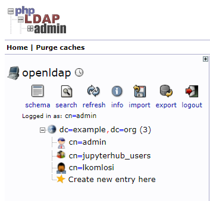
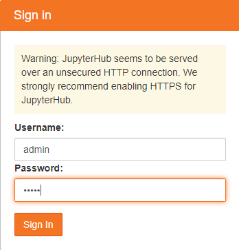
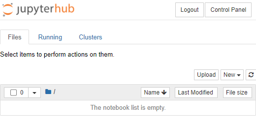
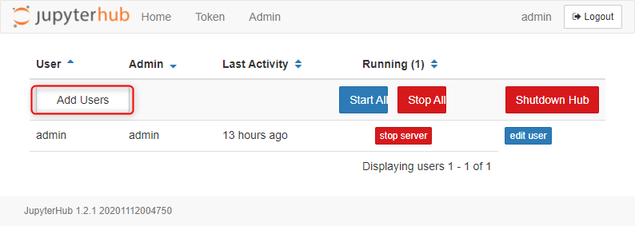
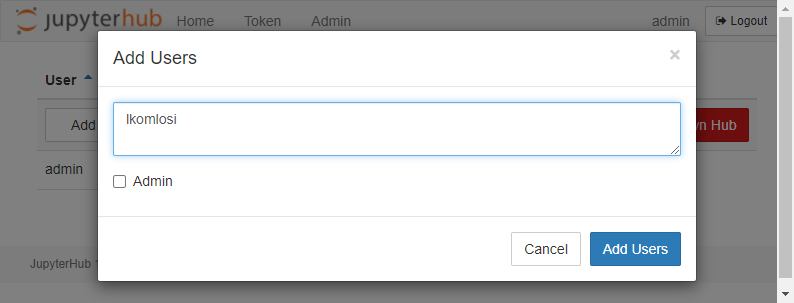
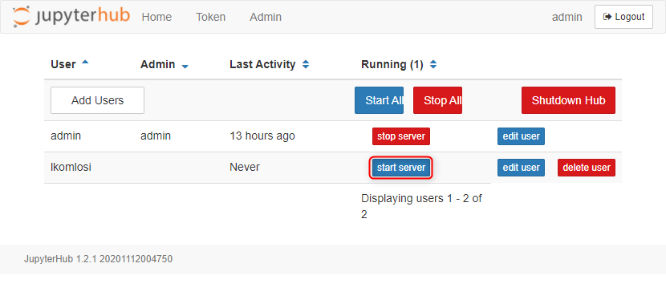
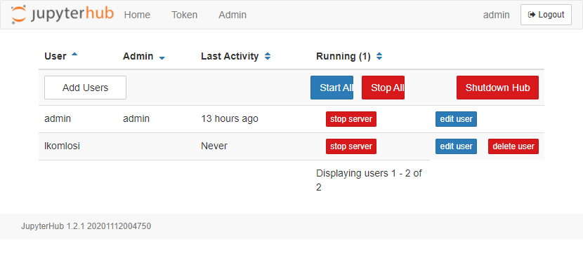
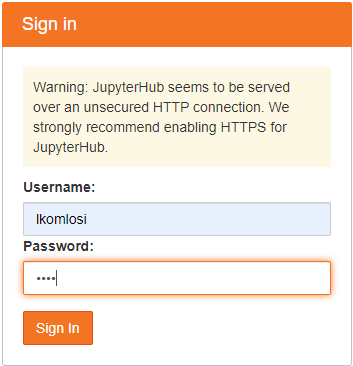
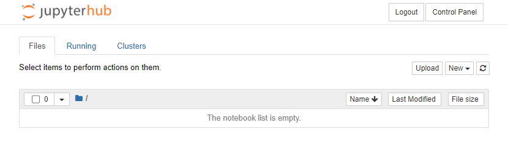

# docker-jupyterhub+ldap

# Services

## OpenLDAP

## PhpLDAPadmin

## Jupyterhub

# Volumes

## LDAP

* ldap/lib - user databases
* ldap/slapd.d - ldap configs

# Usage

```
docker build -t jupyterhub/jupyterhub:latest .
docker-compose up
```

* [PHPLDAPadmin](https://localhost:6443)

* [Jupyterhub](http://localhost:8000)

# Users

## PHPadmin

cn=admin,dc=example,dc=org / admin

Existing LDAP accounts:

* admin/admin

* lkomlosi/laca

After creating the lkomlosi user in Jupyterhub, you can log in with that too.

# Tutorial

1) PHPLDAPadmin



2) Jupyterhub admin login



3) Jupyterhub admin UI



4) Jupyterhub admin UI Control Panel


5) Jupyterhub admin Add User



6) Jupyterhub admin Add User



7) Jupyterhub admin Start user server



8) Jupyterhub admin User server started



9) Jupyterhub lkomlosi login



10) Jupyterhub lkomlosi UI




#
```
 _   _   ___  _   _ _____  ______ _   _ _   _ 
| | | | / _ \| | | |  ___| |  ___| | | | \ | |
| |_| |/ /_\ \ | | | |__   | |_  | | | |  \| |
|  _  ||  _  | | | |  __|  |  _| | | | | . ` |
| | | || | | \ \_/ / |___  | |   | |_| | |\  |
\_| |_/\_| |_/\___/\____/  \_|    \___/\_| \_/
```

